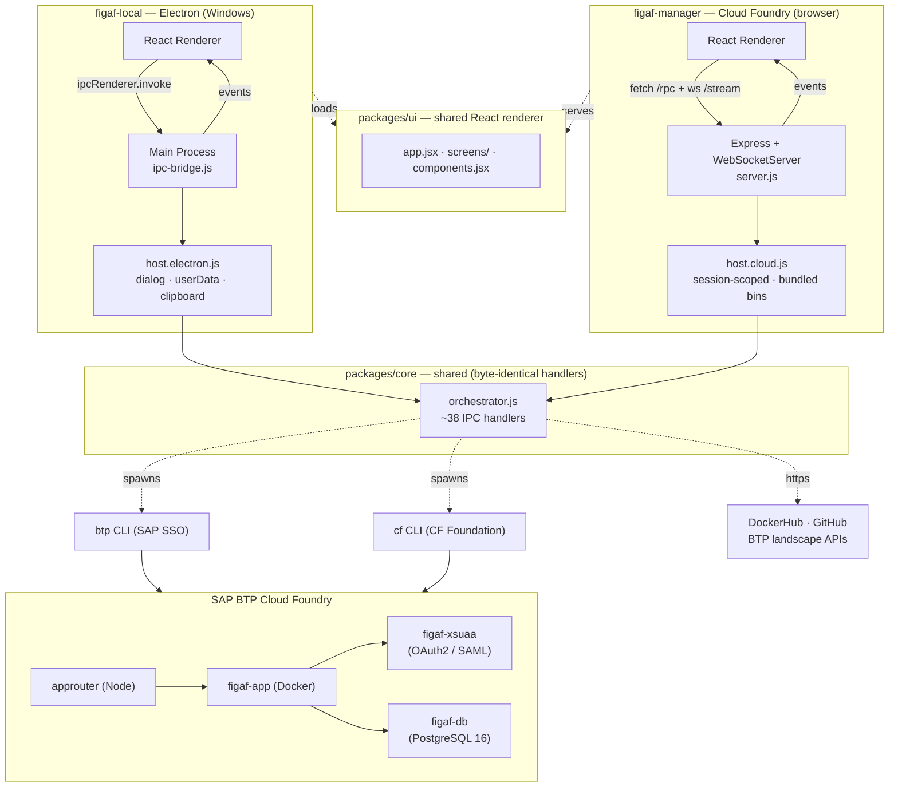

# Figaf Installer

A wizard that deploys the [Figaf Tool](https://figaf.com) to your **SAP BTP
Cloud Foundry** subaccount in a few clicks — no manual CLI work, no PATH
gymnastics.

The repo is an npm-workspaces monorepo that ships **two** parallel installers
sharing one orchestration layer and one React renderer:

| App | Where it runs | How users get to it |
|---|---|---|
| **figaf-local**   | Windows desktop (Electron)             | Download and run `Figaf-Installer-<v>-x64.exe` |
| **figaf-manager** | A Cloud Foundry space (Express + WS)   | Push the cockpit zip once, then visit its URL  |

Both wrap `btp` and `cf` CLIs, ship the BTP deployment templates, and walk you
through prerequisites → login → service creation → `cf push` → ready-to-use URL.
The wizards diverge only at the host-environment seam (file dialogs, persistent
storage, deploy-template sourcing).

### Quick reference (developers)

| Task | Command |
|------|---------|
| Install all dependencies | `npm install` |
| Run desktop app (dev) | `npm run start:local` |
| Run cloud app locally (dev) | `npm run start:manager` |
| Build Windows `.exe` installer | `npm run build:local` |
| Build BTP Cockpit `.zip` | `npm run build:manager` |

---

## What it does

1. **Checks your environment** — looks for `btp` and `cf` CLIs, Docker Hub
   reachability, and (figaf-local only) free disk space. If a CLI is missing,
   figaf-local downloads and installs it for you (kept under your user data
   folder, no admin rights, no PATH edits); figaf-manager ships the Linux
   binaries inside its zip.
2. **Signs you in** — `btp login --sso` opens your browser, then we discover
   your landscape and run `cf login --sso` with the one-time passcode.
3. **Lets you choose** — *Deploy Figaf Tool* (default) or *Connect to
   Integration Suite* (planned).
4. **Configures the deployment** — auto-detects the apps domain, the latest
   `figaf/app` Docker tag, and the available PostgreSQL plans; you fill in the
   ID and pick a plan.
5. **Provisions services in parallel** — creates `figaf-db` (PostgreSQL),
   `figaf-xsuaa` (OAuth2/role scopes), and assigns the `PI_Administrator` role
   collection to your user.
6. **Pushes the app** — `cf push --vars-file vars.yml`, then opens the deployed
   URL once it's live.

A collapsible terminal drawer streams every CLI command in real time, so
nothing is hidden behind the GUI.

---

## Requirements

- An **SAP BTP** subaccount with a **Cloud Foundry** environment instance and
  permissions to create services and push apps.
- Internet access to:
  - `tools.hana.ondemand.com` (BTP CLI download)
  - `github.com/cloudfoundry/cli/releases` (CF CLI download)
  - `hub.docker.com` (image tag lookup + image pull)
  - `github.com/figaf/Figaf-BTP-Deployment` (deploy templates — figaf-manager only)
- For figaf-local: Windows 10 / 11 (x64).
- For figaf-manager: a CF space you can push to (the wizard itself runs there).

---

## Install (end users)

### Desktop — figaf-local

Download the latest `Figaf-Installer-<version>-x64.exe` from your release
source and run it. The NSIS installer offers per-user install with desktop and
start-menu shortcuts. Launch **Figaf Installer** and follow the wizard.

### Cloud — figaf-manager

You need **two files**:

| File | Where to get it |
|------|----------------|
| `figaf-manager-app-<version>.zip` | Built by `npm run build:manager` or from a release |
| `apps/figaf-manager/manifest.yml` | Checked into this repo — use as-is |

Deploy via BTP Cockpit: **Space → Applications → Deploy Application**, upload the `.zip` as the application archive and `manifest.yml` as the deployment descriptor, then click **Deploy**. Once green, open the assigned URL in a browser.

> **Tip:** `FIGAF_MANAGER_MAINTENANCE: 1` is set in `manifest.yml` by default. Comment it out before deploying to make the wizard immediately accessible.

---

## Run from source (developers)

The repo is an npm workspace. Install once at the root:

```sh
npm install
```

That hoists shared deps and symlinks `@figaf/core`, `@figaf/ui`, and
`@figaf/deploy-templates` into each app.

### Start the Electron app (figaf-local)

```sh
npm run start:local
# equivalent to:  npm --workspace apps/figaf-local start
```

DevTools opens detached.

### Start the cloud app (figaf-manager) locally

```sh
npm run start:manager
# equivalent to:  npm --workspace apps/figaf-manager start
```

Then visit `http://localhost:8080`. In dev mode the host adapter falls back to
`btp` / `cf` on `$PATH` if `apps/figaf-manager/bin/` is empty.

### Build the Windows installer (standalone `.exe`)

```sh
npm run build:local
```

Output: **`apps/figaf-local/dist/Figaf-Installer-<version>-x64.exe`**

Double-click to run. The NSIS installer is self-contained — no Node.js or Electron runtime required on the target machine. It creates a Start Menu shortcut and a desktop icon. The BTP deployment templates are bundled as `extraResources` inside the installer.

### Build the BTP Cockpit zip

```sh
npm run build:manager
```

Output: **`apps/figaf-manager/dist/figaf-manager-app-<version>.zip`**

The script downloads pinned Linux `btp` + `cf` binaries into `apps/figaf-manager/bin/` (cached — skipped on subsequent runs), stages a self-contained app tree under `.staging/`, then zips it. Upload the resulting `.zip` together with `apps/figaf-manager/manifest.yml` via BTP Cockpit *Deploy Application*.

---

## Project layout

```
figaf-installer/                          ← workspace root (npm workspaces)
├── apps/
│   ├── figaf-local/                      Electron desktop installer
│   │   ├── main-process/
│   │   │   ├── main.js                     BrowserWindow + frameless chrome
│   │   │   ├── preload.js                  contextBridge → window.figaf
│   │   │   ├── ipc-bridge.js               wires orchestrator handlers to ipcMain
│   │   │   └── host.electron.js            HostAdapter: dialog, userData, clipboard
│   │   └── package.json                  electron + electron-builder
│   └── figaf-manager/                    Cloud-hosted installer
│       ├── cloud/
│       │   ├── server.js                   Express RPC + WebSocket
│       │   ├── client.js                   browser window.figaf shim (fetch + ws)
│       │   └── index.html                  cloud renderer shell
│       ├── host.cloud.js                 HostAdapter: session-scoped, bundled bin
│       ├── bin/                          Linux btp + cf binaries (build-time)
│       ├── scripts/build-zip.js          assembles the cockpit zip
│       ├── manifest.yml, Dockerfile      CF deployment manifest + container
│       └── package.json                  express + ws
└── packages/
    ├── core/                             host-agnostic orchestrator
    │   ├── orchestrator.js                 ~38 IPC handlers + HostAdapter typedef
    │   └── index.js
    ├── ui/                               shared React renderer (no bundler)
    │   ├── app.jsx                         <App/> wizard state machine
    │   ├── screens.jsx                     per-step screens
    │   ├── components.jsx                  shared primitives + frameless chrome
    │   ├── mode.js                         window.figafModeFlags (isHosted + features)
    │   ├── styles.css, electron-app.css
    │   ├── index.html                      Electron renderer shell
    │   └── figaf-logo.png
    └── deploy-templates/                 BTP CF deployment templates
        ├── manifest.yml                    approuter + figaf-app
        ├── vars.yml                        rewritten at runtime
        ├── db.json, xs-security.json
        └── approuter/                      @sap/approuter
```

For a deeper architectural reference (IPC surface, event channels, subprocess
invariants, host-adapter contract), see [CLAUDE.md](CLAUDE.md).

---

## Architecture at a glance



Both renderers consume the **same** `window.figaf` IPC surface (`prereq.*`,
`btp.*`, `cf.*`, `config.*`, `shell.*`, `on(channel, handler)`). figaf-local
implements that surface with `ipcRenderer.invoke`; figaf-manager implements it
with `fetch("/rpc/:channel")` + `WebSocket("/stream")`. The orchestrator
handlers are byte-identical between the two — see
[packages/core/orchestrator.js](packages/core/orchestrator.js).

---

## What's bundled vs. what's downloaded

| | figaf-local | figaf-manager |
|---|---|---|
| BTP deployment templates | bundled (`extraResources`)         | downloaded at runtime from GitHub |
| `btp` + `cf` CLIs        | downloaded on first run if missing | bundled in `bin/` (Linux)         |

For figaf-local, missing CLIs are stored under your user data folder; absolute
paths persisted to `cliPaths.json`. PATH is never modified.

---

## Roadmap

- **Connect to Integration Suite** — the wizard already exposes the choice, but
  the flow is a placeholder. Will allow linking an existing Figaf deployment to
  an SAP Integration Suite tenant for tracking and testing.
- **PI/PO connectivity** — `figaf-connectivity` and `figaf-destination`
  services are reserved (commented out) in
  [packages/deploy-templates/manifest.yml](packages/deploy-templates/manifest.yml)
  for cloud-connector-based PI/PO agent integration.

Both apps will pick up new wizard steps and IPC handlers automatically — see
*Conventions when editing* in [CLAUDE.md](CLAUDE.md).

---

## License

Unlicensed (private). The bundled BTP deployment templates are © Figaf and
distributed under their original license — see
[packages/deploy-templates/LICENSE](packages/deploy-templates/LICENSE).
