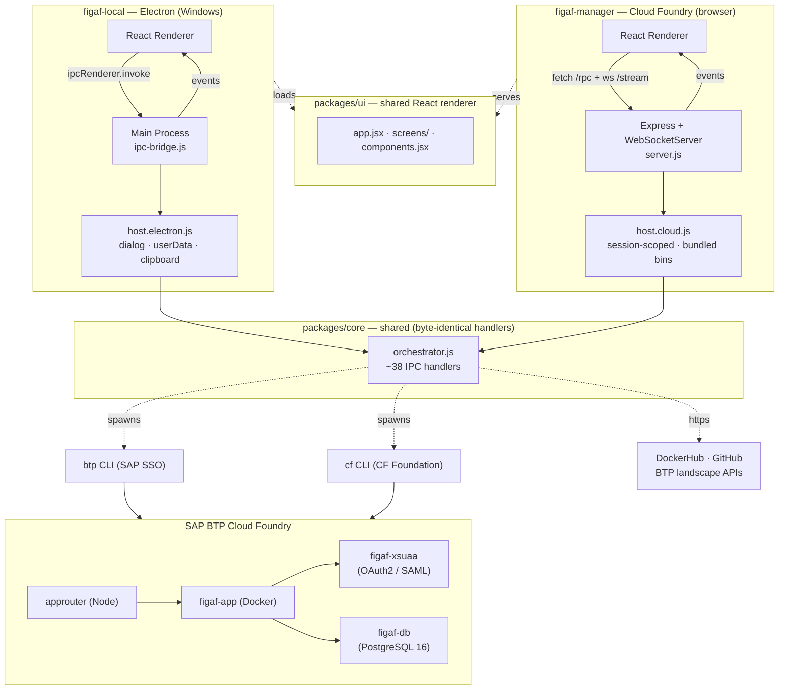

# Figaf Installer

[](https://github.com/figaf/FigafManager/actions/workflows/ci.yml)

A wizard that deploys the [Figaf Tool](https://figaf.com) to your **SAP BTP
Cloud Foundry** subaccount in a few clicks — no manual CLI work, no PATH
gymnastics.

The repo is an npm-workspaces monorepo that ships **two** parallel installers
sharing one orchestration layer and one React renderer:

| App | Where it runs | How users get to it |
|---|---|---|
| **figaf-local**   | Windows desktop (Electron)             | Download the `.exe` from Releases and run it   |
| **figaf-manager** | A Cloud Foundry space (Express + WS)   | Push the cockpit zip once, then visit its URL  |

Both wrap `btp` and `cf` CLIs, ship the BTP deployment templates, and walk you
through prerequisites → login → service creation → `cf push` → ready-to-use URL.
The wizards diverge only at the host-environment seam (file dialogs, persistent
storage, deploy-template sourcing).

### Quick reference (developers)

| Task | Command |
|------|---------|
| Install all dependencies | `npm install` |
| Run desktop app (dev) | `npm run start:local` |
| Run cloud app locally (dev) | `npm run start:manager` |
| Build Windows app (installer + portable `.exe`) | `npm run build:local` |
| Build BTP Cockpit `.zip` | `npm run build:manager` |

---

## What it does

1. **Checks your environment** — looks for `btp` and `cf` CLIs, Docker Hub
   reachability, and (figaf-local only) free disk space. If a CLI is missing,
   figaf-local downloads and installs it for you (kept under your user data
   folder, no admin rights, no PATH edits); figaf-manager ships the Linux
   binaries inside its zip.
2. **Signs you in** — `btp login --sso` opens your browser, then we discover
   your landscape and run `cf login --sso` with the one-time passcode.
3. **Lets you choose an action** — *Deploy Figaf Tool* (fresh install),
   *Update Figaf Tool* (refresh an existing deployment to the latest image),
   *Connect to Integration Suite* (wire up an existing deployment), and — on the
   cloud installer only — *Enable persistent SSO login* (the XSUAA upgrade,
   see [Securing the cloud installer](#securing-the-cloud-installer-figaf-manager)).
4. **Configures the deployment** — auto-detects the apps domain, the latest
   `figaf/app` Docker tag, and the available PostgreSQL plans; you fill in the
   ID and pick a plan.
5. **Provisions services in parallel** — creates `figaf-db` (PostgreSQL),
   `figaf-xsuaa` (OAuth2/role scopes), and assigns the `PI_Administrator` role
   collection to your user.
6. **Pushes the app** — `cf push --vars-file vars.yml`, then opens the deployed
   URL once it's live.

A collapsible terminal drawer streams every CLI command in real time, so
nothing is hidden behind the GUI. Secrets (service keys, JWTs, setup tokens) are
redacted from the stream and from the audit log before they're ever shown or
written.

### The other actions

- **Update Figaf Tool** — detects the running deployment, seeds the form from
  its *live* `vars.yml` (so an update never silently changes memory, domain,
  location, or SMTP settings), lets you pick a target Docker tag and a `cf push`
  strategy (`recreate` vs. rolling), pulls the latest deploy templates, then
  applies the update and verifies it.
- **Connect to Integration Suite** — provisions the `it-rt` *api* and
  *integration-flow* services, creates and fetches their service keys, then
  configures BTP access. The **custom SAML IdP** path is complete (creates the
  cockpit trust configuration, resolves the IdP origin, builds the SSO URL, and
  assigns the `PI_*` role collections); the IAS / S-user / passport auth modes
  are still stubs.

---

## Requirements

- An **SAP BTP** subaccount with a **Cloud Foundry** environment instance and
  permissions to create services and push apps.
- Internet access to:
  - `tools.hana.ondemand.com` (BTP CLI download)
  - `github.com/cloudfoundry/cli/releases` (CF CLI download)
  - `hub.docker.com` (image tag lookup + image pull)
  - `github.com/figaf/Figaf-BTP-Deployment` (deploy templates — figaf-manager only)
- For figaf-local: Windows 10 / 11 (x64).
- For figaf-manager: a CF space you can push to (the wizard itself runs there).

---

## Install (end users)

### Desktop — figaf-local

Download the portable app from the [**Releases page**](../../releases/latest):

| File | Use it when |
|------|-------------|
| `Figaf-Installer-<v>-x64.exe` | **Just run it** — standalone portable app. Double-click to launch, no installation, no admin rights. |

Launch **Figaf Installer** and follow the wizard. (An NSIS setup installer is also produced by the build but is **not published** — the portable needs no installation.)

### Cloud — figaf-manager

You need **two files**:

| File | Where to get it |
|------|----------------|
| `figaf-manager-app-<version>.zip` | Attached to each [release](../../releases/latest), or built by `npm run build:manager` |
| `manifest.yml` | Attached to the same release, or `apps/figaf-manager/manifest.yml` from this repo — use as-is |

Deploy via BTP Cockpit: **Space → Applications → Deploy Application**, upload the `.zip` as the application archive and `manifest.yml` as the deployment descriptor, then click **Deploy**. Once green, open the assigned URL in a browser.

> **Tip:** `FIGAF_MANAGER_MAINTENANCE: 1` is set in `manifest.yml` by default. Comment it out before deploying to make the wizard immediately accessible.

---

## Securing the cloud installer (figaf-manager)

The cloud installer runs on a **public Cloud Foundry route** — anyone who learns
the URL could otherwise drive it. It ships with a two-phase auth gate so it's
never unauthenticated:

1. **Token gate (default, zero config).** On boot the app generates a one-time
   setup token and prints it **once** to stdout, tagged `[SETUP]`. Open the app
   URL, go to the `/setup` page, and paste the token from the BTP Cockpit
   **Logs** view. The first successful claim consumes the token, mints a signed
   session cookie, and closes `/setup` (it returns `410 Gone` afterward). No
   pre-deploy configuration and no `cf` CLI is required — reading the cockpit log
   is the only capability the gate depends on.
2. **Persistent SSO (optional, in-wizard upgrade).** After signing in, choose
   **Enable persistent SSO login**. The wizard provisions an XSUAA service and
   pushes a bundled [`@sap/approuter`](packages/manager-approuter/) in front of
   itself, then deep-links you to assign yourself the role collection in the
   cockpit (~30 s). From then on you reach the wizard through the approuter and
   authenticate with SAP IAS single sign-on — no more cockpit-log token.

The session cookie is signed with `FIGAF_AUTH_SECRET` (a per-boot random value
when unset). The manager also self-destructs after a configurable idle period.
See [docs/auth-gate-implementation-plan.md](docs/auth-gate-implementation-plan.md)
for the full design.

---

## Run from source (developers)

The repo is an npm workspace. Install once at the root:

```sh
npm install
```

That hoists shared deps and symlinks `@figaf/core`, `@figaf/ui`, and
`@figaf/deploy-templates` into each app.

### Start the Electron app (figaf-local)

```sh
npm run start:local
# equivalent to:  npm --workspace apps/figaf-local start
```

DevTools opens detached.

### Start the cloud app (figaf-manager) locally

```sh
npm run start:manager
# equivalent to:  npm --workspace apps/figaf-manager start
```

Then visit `http://localhost:8080`. In dev mode the host adapter falls back to
`btp` / `cf` on `$PATH` if `apps/figaf-manager/bin/` is empty.

### Build the Windows app

```sh
npm run build:local
```

Produces **two** artifacts in `apps/figaf-local/dist/`, both self-contained (no Node.js or Electron runtime needed on the target machine):

| File | Type |
|------|------|
| `Figaf-Installer-<version>-x64.exe` | **Portable** — double-click to run, no install |
| `Figaf-Installer-Setup-<version>-x64.exe` | **Installer** — NSIS setup wizard, creates shortcuts |

The BTP deployment templates are bundled as `extraResources` inside both. The release workflow publishes only the **portable** exe (it needs no installation); the NSIS installer is built but not attached. Don't commit either — `dist/` is gitignored to keep the ~80 MB+ binaries out of git history.

### Build the BTP Cockpit zip

```sh
npm run build:manager
```

Output: **`apps/figaf-manager/dist/figaf-manager-app-<version>.zip`**

The script downloads pinned Linux `btp` + `cf` binaries into `apps/figaf-manager/bin/` (cached — skipped on subsequent runs), stages a self-contained app tree under `.staging/`, then zips it. Upload the resulting `.zip` together with `apps/figaf-manager/manifest.yml` via BTP Cockpit *Deploy Application*.

---

## Project layout

```
figaf-installer/                          ← workspace root (npm workspaces)
├── apps/
│   ├── figaf-local/                      Electron desktop installer
│   │   ├── main-process/
│   │   │   ├── main.js                     BrowserWindow + frameless chrome
│   │   │   ├── preload.js                  contextBridge → window.figaf
│   │   │   ├── ipc-bridge.js               wires orchestrator handlers to ipcMain
│   │   │   └── host.electron.js            HostAdapter: dialog, userData, clipboard
│   │   └── package.json                  electron + electron-builder
│   └── figaf-manager/                    Cloud-hosted installer
│       ├── cloud/
│       │   ├── server.js                   Express RPC + WebSocket
│       │   ├── auth.js                      token-gate auth (setup token, session cookie)
│       │   ├── xsuaa-auth.js                v2 XSUAA/JWT verification
│       │   ├── client.js                    browser window.figaf shim (fetch + ws)
│       │   ├── index.html, setup.html       cloud renderer shell + /setup claim page
│       │   └── *.test.js                    auth, ws, xsuaa, restage tests (node:test)
│       ├── host.cloud.js                 HostAdapter: session-scoped, bundled bin
│       ├── bin/                          Linux btp + cf binaries (build-time)
│       ├── scripts/build-zip.js          assembles the cockpit zip
│       ├── manifest.yml, Dockerfile      CF deployment manifest + container
│       └── package.json                  express + ws
└── packages/
    ├── core/                             host-agnostic orchestrator
    │   ├── orchestrator.js                 ~38 IPC handlers + HostAdapter typedef
    │   ├── audit-log.js                     append-only audit log (with secret redaction)
    │   ├── redact-service-key.js            scrubs service-key / JWT material from output
    │   ├── saml-connect.js                  pure SAML/IdP-trust logic (Connect flow)
    │   ├── db-schemas.js                    PostgreSQL params + hyperscaler/trial defaults
    │   └── index.js
    ├── ui/                               shared React renderer (no bundler)
    │   ├── app.jsx                         <App/> wizard state machine (deploy/update/connect/xsuaa)
    │   ├── screens/                         one file per wizard step group (screen-*.jsx)
    │   ├── components.jsx                  shared primitives + frameless chrome
    │   ├── mode.js                         window.figafModeFlags (isHosted + features)
    │   ├── styles.css, electron-app.css
    │   ├── index.html                      Electron renderer shell
    │   └── figaf-logo.png
    ├── manager-approuter/                v2 @sap/approuter pushed in front of figaf-manager
    │   ├── server.js                        maintenance gate + approuter bootstrap
    │   └── maintenance.html
    └── deploy-templates/                 BTP CF deployment templates
        ├── manifest.yml                    approuter + figaf-app
        ├── vars.yml                        rewritten at runtime
        ├── db.json, xs-security.json
        └── approuter/                      @sap/approuter
```

For a deeper architectural reference (IPC surface, event channels, subprocess
invariants, host-adapter contract), see [CLAUDE.md](CLAUDE.md).

---

## Architecture at a glance



Both renderers consume the **same** `window.figaf` IPC surface (`prereq.*`,
`btp.*`, `cf.*`, `config.*`, `shell.*`, `on(channel, handler)`). figaf-local
implements that surface with `ipcRenderer.invoke`; figaf-manager implements it
with `fetch("/rpc/:channel")` + `WebSocket("/stream")`. The orchestrator
handlers are byte-identical between the two — see
[packages/core/orchestrator.js](packages/core/orchestrator.js).

---

## What's bundled vs. what's downloaded

| | figaf-local | figaf-manager |
|---|---|---|
| BTP deployment templates | bundled (`extraResources`)         | downloaded at runtime from GitHub |
| `btp` + `cf` CLIs        | downloaded on first run if missing | bundled in `bin/` (Linux)         |

For figaf-local, missing CLIs are stored under your user data folder; absolute
paths persisted to `cliPaths.json`. PATH is never modified.

---

## Roadmap

- **Connect to Integration Suite — remaining IdP modes.** The flow is built and
  the custom SAML IdP path is complete; the **IAS**, **S-user**, and **passport**
  authentication modes are still stubs (`screen-connect-idp-{ias,suser,passport}.jsx`).
- **PI/PO connectivity** — `figaf-connectivity` and `figaf-destination`
  services are reserved (commented out) in
  [packages/deploy-templates/manifest.yml](packages/deploy-templates/manifest.yml)
  for cloud-connector-based PI/PO agent integration.

Both apps will pick up new wizard steps and IPC handlers automatically — see
*Conventions when editing* in [CLAUDE.md](CLAUDE.md).

---

## License

Unlicensed (private). The bundled BTP deployment templates are © Figaf and
distributed under their original license — see
[packages/deploy-templates/LICENSE](packages/deploy-templates/LICENSE).
